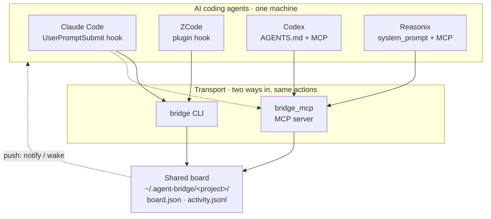

# Roundtable

**English** | [简体中文](README.zh-CN.md)

**Turn the AI coding agents on your computer into one team.**

Roundtable lets **Claude Code, Codex, Reasonix and ZCode** — running on the
**same machine** — work together: hand off tasks, share one board, ask each
other questions, review each other's work. Works in both the desktop apps and
the terminal. One command to install. No servers, no cloud, no dependencies.

> The CLI is `bridge`. State lives in `~/.agent-bridge/`. That's all you need to remember.

---

## Quick start

```bash
# 1. Install for every supported app found on this machine
#    via npm (no clone):  npx @xyva-yuangui/roundtable install --auto
#    or from this repo:
./install.sh --auto

# 2. From one agent, hand a task to another (auto-wakes the target by default)
bridge send --to codex --subject "Design the auth module" --body "JWT + refresh"

# 3. The other agent sees it, does it, reports back
bridge inbox            # what needs my attention (with the details)
bridge claim <id>       # I'll take it
bridge done <id> --result "see auth/design.md"

bridge board            # everyone's tasks at a glance
```

That's the whole loop: **send → claim → done**. Everything else is extra.

---

## How it works



A shared file board is the single source of truth (safe under `flock` + atomic
writes). Agents reach it two ways — the `bridge` CLI, or an MCP server for the
desktop apps. Each agent stays aware through its own native mechanism, and you
can actively **wake** idle ones.

---

## Supported agents

| Agent | Desktop | CLI | Notices tasks via |
|---|:---:|:---:|---|
| **Claude Code** | ✅ | ✅ | hook every turn (automatic) |
| **ZCode** | ✅ | — | plugin hook every turn (automatic) |
| **Codex** | ✅ | ✅ | standing instruction + MCP, or `--wake` |
| **Reasonix** | ✅ | ✅ | standing instruction + MCP, or `--wake` |

---

## Install

```bash
./install.sh --auto                     # detect installed apps, wire each one
./install.sh --agent codex --as codex   # or one at a time
./install.sh --uninstall --agent codex  # remove
```

Re-running is safe (idempotent). After installing, **restart Codex / Reasonix /
ZCode** so they load the new config; Claude Code picks it up on the next prompt.

**Requirements:** macOS or Linux, Python 3.9+ (standard library only), and one
or more of the four apps.

---

## Good to know

**Routing isn't hard-coded.** Each agent advertises its strengths
(`bridge agents`); whoever is coordinating picks the right one for the job and
`bridge send --to <agent>`.

**Agents only collaborate inside the same project.** A project is tied to a
folder. Run `bridge project init` in a repo, and only agents working in that
same folder can see its board — others are refused. (Same OS user, so this is
scoping, not a hard security wall.)

**Auto-push: send wakes the target.** Every `bridge send` auto-wakes the target
agent by default. Use `--no-wake` to opt out for non-urgent tasks. Sending also
shows a desktop notification.

**Auto-cleanup keeps the board tidy.** The board maintains itself with zero
manual effort:

| Mechanism | Trigger | Rule |
|---|---|---|
| Silent auto-clean | Every `bridge status` call | Completed tasks older than 7 days (when ≥10 tasks on board) |
| Stale task detection | Every `bridge status` call | Working tasks stuck >24h → auto-failed |
| Overflow archive | After `bridge done` | Completed tasks >50 → oldest half archived |

All cleaned tasks go to `archive.json` — never lost, just out of the way.

**One machine = one team.** Install it on every machine you want a team on.
Each machine is its own board — Machine A's agents don't talk to Machine B's.

---

## Commands

| Command | Does |
|---|---|
| `bridge status` | Quick inbox summary (used by the hooks) |
| `bridge send --to <agent> --subject "..." [--body "..."] [--no-wake]` | Hand off a task (auto-wakes by default) |
| `bridge inbox` | Tasks needing you (with body + any Q&A) |
| `bridge show <id>` | Full detail of one task |
| `bridge claim <id>` / `bridge done <id> --result "..."` | Take / finish |
| `bridge question <id> --body "..."` / `bridge answer <id> --body "..."` | Ask / answer |
| `bridge review <id> [--verdict approve\|changes]` | Request / give a review |
| `bridge board` / `bridge agents` / `bridge activity` | Board / team / history |
| `bridge clean --days 7` / `bridge clean --all` / `bridge clean --dry-run` | Clean up old tasks |
| `bridge wake <agent>` | Make an idle agent check now |
| `bridge project init` / `bridge context --add "..."` | Register a project / share notes |
| `bridge doctor` | Health check |

Desktop apps call the same actions as MCP tools (`bridge_send`, `bridge_inbox`, …).

---

## Troubleshooting

Run `bridge doctor`. Most common: an agent didn't check this turn — just tell it
"check your agent-bridge inbox", or use `--wake`. After install, restart the app
so it loads the MCP config.

## Testing

```bash
python3 scripts/test_mcp.py        # cross-agent round-trip
python3 scripts/test_isolation.py  # project isolation
```

## Acknowledgements

Roundtable is glue — thanks to the agents it connects:

- [Claude Code](https://github.com/anthropics/claude-code) — Anthropic
- [Codex](https://github.com/openai/codex) — OpenAI
- [Reasonix (DeepSeek-Reasonix)](https://github.com/esengine/DeepSeek-Reasonix)
- [ZCode](https://z.ai) — Z.ai (GLM)

## License

[MIT](LICENSE)
