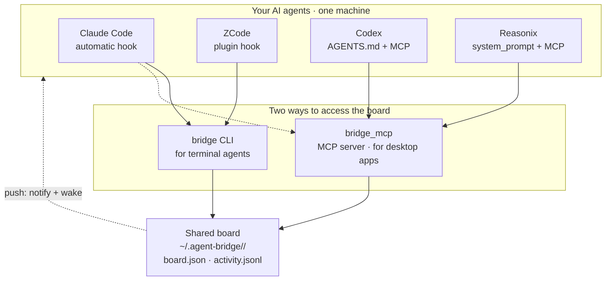

# agent-bridge

**English** | [简体中文](README.zh-CN.md)

**Make your AI coding agents work as a team. Local. Zero config. No cloud.**

You have Claude Code, Codex, Reasonix, ZCode — but they don't talk to each other. **agent-bridge** gives them a shared task board on your machine. Hand off work, ask questions, review code — without leaving your terminal. One command to install, zero dependencies, nothing leaves your machine.

> The CLI is `bridge`. Everything lives in `~/.agent-bridge/`. That's it.

---

## Why agent-bridge?

| | Without agent-bridge | With agent-bridge |
|---|---|---|
| **Task handoff** | Copy-paste between terminals | `bridge send --to codex "Design auth"` |
| **Status tracking** | "Did you finish that?" | `bridge board` — see everything at a glance |
| **Code review** | Slack, PR comments, context switching | `bridge review <id> --verdict approve` |
| **Context sharing** | Scattered across chats | `bridge context --add "decided on JWT"` |
| **Maintenance** | Manual cleanup | Auto-cleans stale tasks, archives old ones |

**It's like `git` for agent collaboration** — a shared workspace that every agent on your machine can read and write, with no server, no signup, no cost.

---

## Quick start

```bash
# 1. One command to wire up every agent on this machine
./install.sh --auto

# 2. Send a task (auto-wakes the target)
bridge send --to codex --subject "Design the auth module" --body "JWT + refresh tokens"

# 3. The other agent picks it up
bridge inbox            # see what's assigned to me
bridge claim <id>       # I'm on it
bridge done <id> --result "see auth/design.md"

bridge board            # everyone's tasks at a glance
```

The whole loop: **send → claim → done**. Everything else is extra.

---

## How it works



A single JSON file is the source of truth (`flock` + atomic writes). Agents read and write it through the CLI or MCP. Every agent checks its inbox at the start of each turn — no polling, no servers, no cloud.

---

## Supported agents

| Agent | Desktop | CLI | How it checks in |
|---|:---:|:---:|---|
| **Claude Code** | ✅ | ✅ | UserPromptSubmit hook (automatic) |
| **ZCode** | ✅ | — | Plugin hook (automatic) |
| **Codex** | ✅ | ✅ | AGENTS.md directive + MCP |
| **Reasonix** | ✅ | ✅ | system_prompt + MCP, or `--wake` |

---

## Key features

### 🎯 Smart routing (not hard-coded rules)
Each agent advertises its strengths (`bridge agents`). The coordinating agent reads the team profile and decides who gets what — no rigid routing tables. Use `--skill` as a fallback hint.

### 🔒 Project-scoped collaboration
Run `bridge project init` in a repo. Only agents working inside that folder can see its board. Different projects are completely isolated.

### ⚡ Auto-push: send wakes the target
Every `bridge send` auto-wakes the target agent. Desktop notification + headless execution — no manual terminal switching. Use `--no-wake` for non-urgent tasks.

### 🧹 Auto-cleanup (zero maintenance)
The board maintains itself:

| Mechanism | Trigger | Rule |
|---|---|---|
| Silent auto-clean | Every `bridge status` call | Completed tasks older than 7 days (when board has ≥10 tasks) |
| Stale task detection | Every `bridge status` call | Working tasks stuck >24h → auto-failed |
| Overflow archive | After `bridge done` | Completed tasks >50 → oldest half archived to `archive.json` |

### 🏠 100% local, 100% private
No cloud, no server, no account. Everything lives in `~/.agent-bridge/`. One machine = one team. Sync via Syncthing, Dropbox, or git if you want multi-machine.

---

## Install

```bash
./install.sh --auto                     # detect all agents, wire each one
./install.sh --agent codex --as codex   # or install one at a time
./install.sh --uninstall --agent codex  # remove
```

Re-running is safe (idempotent). Restart your agents after install.

**Requirements:** Python 3.9+ (standard library only), and at least one of the four supported agents.

---

## Commands

| Command | What it does |
|---|---|
| `bridge status` | Quick inbox count (used by hooks every turn) |
| `bridge send --to <agent> --subject "..." [--body "..."] [--no-wake]` | Hand off a task (auto-wakes by default) |
| `bridge send --skill coding --subject "..."` | Auto-route to best agent for that skill |
| `bridge inbox` | Tasks needing your action (with body + Q&A) |
| `bridge show <id>` | Full detail of one task — read before working |
| `bridge claim <id>` / `bridge done <id> --result "..."` | Take ownership / mark complete |
| `bridge question <id> --body "..."` / `bridge answer <id> --body "..."` | Ask a question / answer (blocks/unblocks task) |
| `bridge review <id> [--verdict approve\|changes]` | Request or give a code review |
| `bridge board` / `bridge agents` / `bridge activity` | Full board / team matrix / activity feed |
| `bridge clean --days 7` / `--all` / `--dry-run` | Clean up old tasks |
| `bridge wake <agent>` | Push an idle agent to check its inbox now |
| `bridge whoami` / `bridge who-coordinates` | Identity check / see who's coordinating |
| `bridge project init` / `bridge context --add "..."` | Create project / share context notes |
| `bridge doctor` | Health check |

Desktop apps call the same actions as MCP tools: `bridge_send`, `bridge_inbox`, `bridge_claim`, `bridge_done`, `bridge_review`, `bridge_clean`, etc.

---

## Troubleshooting

```bash
bridge doctor    # checks identity, permissions, board, hooks, agent heartbeats
```

Most common issue: an agent didn't check this turn. Tell it "check your agent-bridge inbox", or use `bridge wake <agent>`. After install, restart the app so it loads MCP config.

## Testing

```bash
python3 scripts/test_mcp.py        # cross-agent round-trip
python3 scripts/test_isolation.py  # project isolation
```

## Acknowledgements

agent-bridge is the glue — thanks to the agents it connects:

- [Claude Code](https://github.com/anthropics/claude-code) — Anthropic
- [Codex](https://github.com/openai/codex) — OpenAI
- [Reasonix (DeepSeek-Reasonix)](https://github.com/esengine/DeepSeek-Reasonix)
- [ZCode](https://z.ai) — Z.ai (GLM)

## License

[MIT](LICENSE)