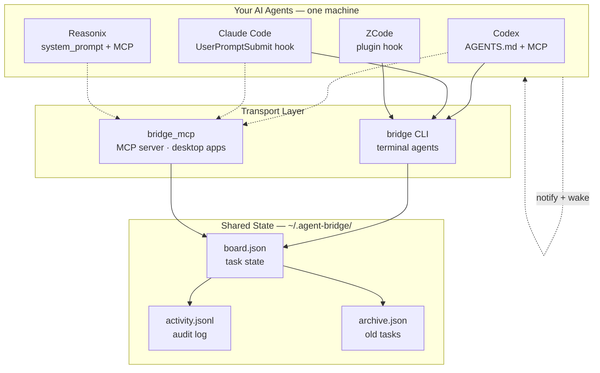
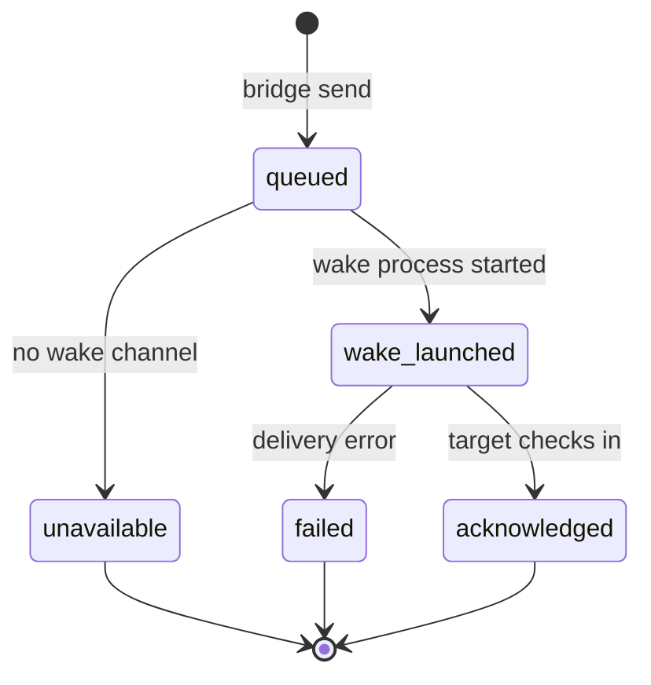
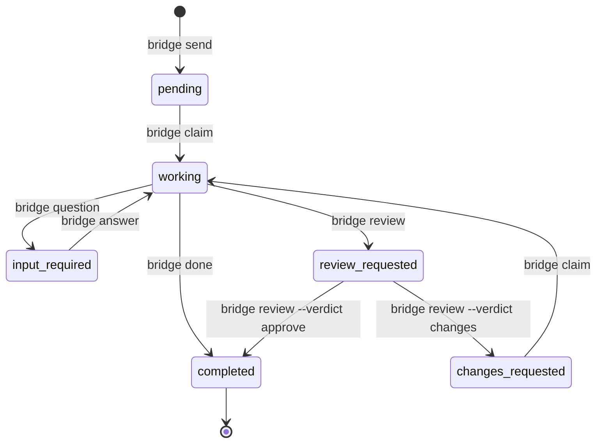

# agent-bridge

**English** | [简体中文](README.zh-CN.md)

Agent Bridge is a local-first task board for Codex, Claude Code, Reasonix, and
ZCode. It uses Python's standard library, keeps data under `~/.agent-bridge`,
and has no resident daemon, network listener, cloud synchronization, or default
telemetry.

[License](LICENSE) (Apache-2.0) · [Security](SECURITY.md) · [Contributing](CONTRIBUTING.md) ·
[Architecture](docs/architecture/v2.md) · [Windows](docs/installation/windows.md) ·
[macOS](docs/installation/macos.md) · [Migration](docs/installation/migration-v1.md) ·
[Release checklist](docs/release/checklist.md)

## Requirements and support boundary

- Python 3.9+ (release CI covers Python 3.9–3.13)
- Windows 10/11 with PowerShell 5.1+, or macOS/Linux with Bash
- A local filesystem; network shares and cloud-sync folders are unsupported

The packaged Windows notification helper targets x86-64. Windows on ARM is
not currently a native release target; macOS ships a universal2 helper for
Intel and Apple Silicon inside the portable ZIP.

The four integrations ship as versioned session-card templates. `bridge setup
status` reports the actual capability for Codex, Claude Code, Reasonix, or
ZCode; when a host is unavailable, use the terminal fallback. Windows source
and CI checks exist. macOS source/CI checks do not prove notification
permission, actions, signing, Gatekeeper, notarization, or Intel/Apple Silicon
behavior: those remain real-machine release requirements.

## Supported agents

| Agent | Desktop | CLI | How it checks in |
|---|:---:|:---:|---|
| **Codex** | ✅ | ✅ | AGENTS.md directive + MCP |
| **Claude Code** | ✅ | ✅ | UserPromptSubmit hook (automatic) |
| **ZCode** | ✅ | — | Plugin hook (automatic) |
| **Reasonix** | ✅ | ✅ | system_prompt + MCP, or `--wake` |

---

## How it works



### Delivery state machine



### Task lifecycle




## Key features

### Cross-platform file locking
Uses `fcntl.flock` on Unix, `O_CREAT|O_EXCL` portable locks on Windows. Stale lock detection with PID validation prevents deadlocks. 40-process concurrent writes tested and verified.

### Smart routing
Each agent advertises its strengths (`bridge agents`). The coordinator reads the team profile and decides who gets what — no rigid routing tables. Use `--skill` as a routing hint.

### Auto-push: send wakes the target
Every `bridge send` auto-wakes the target agent. Desktop notification + headless execution — no manual terminal switching. Use `--no-wake` for non-urgent tasks.

### Delivery tracking
Every notification attempt is observable in `task.delivery.status`:

| Status | Meaning |
|---|---|
| `queued` | Stored, waiting for delivery attempt |
| `wake_launched` | Wake process started (not proof of receipt) |
| `acknowledged` | Target checked in via `status`, `inbox`, or `claim` |
| `unavailable` | No usable notification or wake channel |
| `failed` | Delivery attempt itself failed |

`bridge send` never reports a launched process as an acknowledgment.

### Auto-cleanup
The board maintains itself: completed tasks older than 7 days are silently cleaned, working tasks stuck >24h are auto-failed, and overflow completed tasks are archived to `archive.json`.

### 100% local, 100% private
No cloud, no server, no account. Everything lives in `~/.agent-bridge/`. One machine = one team. Sync via Syncthing, Dropbox, or git for multi-machine.

---

## Install

**Windows (PowerShell):**
```powershell
.\install.ps1 -Auto
.\install.ps1 -Agent codex -As codex -Python C:\path\to\python.exe
bridge setup status
```

**macOS / Linux:**
```bash
./install.sh --auto
./install.sh --agent codex --as codex --python /usr/bin/python3
bridge setup status
```

The installers configure detected hosts conservatively. They create a
receipted launcher and only their own PATH entry/configuration. Restart hosts
after setup, then run `bridge doctor --strict`.

## Workflow

```text
send -> pending -> claim -> working -> done -> completed
                         -> question -> input_required
input_required -> answer -> pending
working -> request review -> review_requested
review_requested -> approve -> completed
review_requested -> changes -> changes_requested -> claim -> working
```

```bash
bridge send --to reasonix --subject "Review the patch" --body "Run tests"
bridge inbox
bridge claim <task-id>
bridge question <task-id> --body "Which target?"
bridge answer <task-id> --body "Python 3.9+"
bridge review <task-id>
bridge review <task-id> --verdict approve --body "Accepted"
bridge done <task-id> --result "Implemented and tested"
```

Only the assignee can claim, ask, request review, or finish a task; only the
sender can answer or give a review verdict.

## Delivery honesty

Each delivery attempt has one observable status:

- `queued`, `dispatching`, `os_posted`, `plugin_delivered`, `viewed`
- `launch_started`, `agent_acknowledged`, `claimed`, `retry_wait`, `failed`

`os_posted`, `plugin_delivered`, and `launch_started` are not acknowledgements.
An acknowledgement requires the target to use `status` or `inbox`; claiming is
stronger evidence. Notification failure does not erase a stored task.

## Operations

```bash
bridge --version
bridge --help
bridge status --oneliner
bridge doctor --strict
bridge setup --repair
bridge setup --dry-run
bridge tui
bridge migrate path/to/v1-board.json
bridge export backup.json
bridge uninstall
bridge uninstall --purge-data
```

`bridge uninstall` preserves task data unless `--purge-data` is explicitly
requested and the command first prints the exact data root. When recovery is
needed, run `bridge setup status`, `bridge doctor`, and `bridge inbox`; there
is no daemon to restart.

## Development and release verification

```bash
python -m unittest discover -s tests -v
python -m compileall -q src scripts tests
python -m build
```

The primary release download is one cross-platform
`agent-bridge-<version>-portable.zip`. It contains the offline bootstrap
wheel, both native helpers (the macOS app is an internal component), both
install scripts, host integration manifests, docs, checksums, and an inventory.
Wheels and the sdist remain supplementary verification artifacts. See the
[release checklist](docs/release/checklist.md) for real-machine native-helper,
signing, notarization, and portable-ZIP installation verification.
