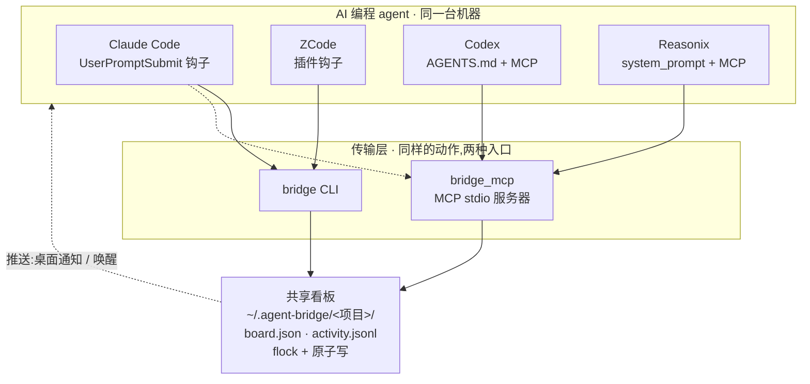

# Roundtable

[English](README.md) | **简体中文**

**让你电脑上的多个 AI 编程 agent 像一个团队一样协作 —— 把它们请到同一张圆桌前。**

> **roundtable** 是项目名。它的 CLI 命令是 `bridge`,共享状态存在
> `~/.agent-bridge/`(全文你会看到的 `agent-bridge` 命名空间)。只需记一个:跑 `bridge`。

roundtable 让**同一台电脑**上的多个 AI 编程 agent —— **Claude Code、Codex、
Reasonix、ZCode** —— 像队友一样协作:派发任务、共享看板、互相提问、互相做代码
审查。它在**桌面应用**和**终端 CLI** 两种形态下都能用,一条命令完成安装。

可以把它理解成本地版的"协同开发":任何一台装了这四个应用 + 本 skill 的电脑,都能
把它们变成一个会协作的团队 —— 无服务器、无云、无外部依赖。

---

## 目录

- [为什么做这个](#为什么做这个)
- [用起来什么感觉](#用起来什么感觉)
- [支持的 agent](#支持的-agent)
- [工作原理](#工作原理)
- [环境要求](#环境要求)
- [安装](#安装)
- [使用](#使用)
- [能力路由](#能力路由)
- [工程隔离(安全)](#工程隔离安全)
- [推送层:唤醒空闲 agent](#推送层唤醒空闲-agent)
- [各 agent 集成细节](#各-agent-集成细节)
- [一台机器 = 一个团队](#一台机器--一个团队)
- [排查问题](#排查问题)
- [测试](#测试)
- [项目结构](#项目结构)
- [路线图](#路线图)
- [许可证](#许可证)

---

## 为什么做这个

原生的多 agent 能力(比如 Claude Code Agent Teams)很强,但都**锁定单一厂商**、
**锁定单个会话**。没人覆盖的空白是:**异构的、各自独立启动的 agent 在同一个工程上
协作。** 这正是 roundtable 做的事 —— Claude、Codex、Reasonix、ZCode 各自启动,
通过一块共享的本地看板协调工作。

设计原则:

- **零依赖。** 纯 Python 3.9+ 标准库,不用 pip 装任何东西。
- **无守护进程、无服务器、无云。** 一块共享文件看板作为唯一真相源。
- **每个 agent 保留自己的强项。** 路由按项目实际情况决定,不写死。
- **天生安全。** 只有处在同一工程目录下的 agent 才能互相协作。

---

## 用起来什么感觉

```bash
# 在你的 Claude 会话里,把活派给最合适的人:
bridge send --to codex --subject "设计 auth 模块" --body "JWT + refresh token"

# Codex(在它自己的 app/CLI 里)下一轮就会看到:
#   📥 agent-bridge: 1 pending (from claude) — run bridge inbox
bridge inbox          # 显示任务 + body
bridge show <id>      # 完整详情
bridge claim <id>     # 认领
bridge done <id> --result "见 auth/design.md"

# 回到 Claude,看板已同步:
bridge board
#   ID            STATUS      OWNER          SUBJECT
#   5b3f1fc81f4a  completed   claude→codex   设计 auth 模块
```

本流程已用**真实的** Codex(GPT-5)和 Reasonix(DeepSeek)agent 端到端验证 ——
它们能自主通过 agent-bridge 认领并完成被派发的任务。

---

## 支持的 agent

| Agent | 桌面应用 | CLI | 如何保持感知 |
|---|:---:|:---:|---|
| **Claude Code** | ✅ | ✅ | `UserPromptSubmit` 钩子(确定性,每轮) |
| **ZCode** | ✅ | — | Claude 格式插件钩子(确定性,每轮) |
| **Codex** | ✅ | ✅ | `AGENTS.md` 指令 + MCP 工具(尽力而为)+ headless 推送 |
| **Reasonix** | ✅ | ✅ | `system_prompt` 指令 + MCP 工具(尽力而为)+ headless 推送 |

---

## 架构图



看板是唯一真相源。agent 通过 `bridge` CLI 或 MCP server 访问它;感知层让它们保持
察觉;推送层去推空闲的那些。工程隔离意味着 agent 只能看到它当前所在工作区的看板。

## 工作原理

四层,每层都尽量小:

1. **状态层 —— 共享看板。** 位于 `~/.agent-bridge/` 的目录。每个项目有一份
   `board.json`(任务)和 `activity.jsonl`(活动流)。写操作由 `fcntl.flock` +
   原子替换保护,多个 agent 并发也不会写坏。

2. **传输层 —— CLI + MCP。** 两种方式访问同一块看板:
   - **`bridge` CLI**,给任何能跑 shell 的工具;
   - **stdlib MCP server**(`bridge_mcp.py`),把同样的动作暴露成工具
     (`bridge_status`、`bridge_send`、`bridge_inbox`、`bridge_show`、
     `bridge_claim`、`bridge_done`、`bridge_review`、`bridge_wake` …)——
     这是能进桌面应用的最大公约数。

3. **感知层 —— 保持察觉。** 每个 agent 用它自己的原生机制接好,以便注意到待办任务
   (见上方表格)。四家也都会发现共享的 `SKILL.md`,里面写了完整协议。

4. **推送层 —— 唤醒空闲 agent。** 拉模型没法送达一个没在看的 agent。所以发任务时
   会弹桌面通知;对支持无头执行的 agent(Codex、Reasonix),你可以主动**唤醒**它们
   立即处理任务。见[推送层](#推送层唤醒空闲-agent)。

---

## 环境要求

- macOS 或 Linux(Windows 未测试)
- Python 3.9+(仅标准库)
- 以下至少一个:Claude Code、Codex、Reasonix、ZCode

---

## 安装

在解压后的仓库目录里:

```bash
# 检测装了哪几个应用,并逐个接好:
./install.sh --auto
```

`--auto` 会给每个工具一个等于其自身名字的身份(这样它们才能互相寻址),并填入合理的
默认"强项"描述。

也可以逐个安装,自定义身份和自由文本强项:

```bash
./install.sh --agent claude   --as claude   --strengths "编排、代码审查、重构、大上下文任务"
./install.sh --agent codex    --as codex    --strengths "硬推理、架构、复杂实现(GPT-5.5)"
./install.sh --agent reasonix --as reasonix --strengths "规划、无头自动化、diff 审查"
./install.sh --agent zcode    --as zcode    --strengths "前端/UI、中文场景、低成本批量"
```

安装具体做了什么(按工具):

- **共享部分:** 把 `bridge.py` + `bridge_mcp.py` 复制到 `~/.agent-bridge/skill/`,
  把 skill 软链到 `~/.agents/skills/`,把 `bridge` 放上 PATH,并记录该 agent 的强项。
- **Claude Code:** 往 `~/.claude/settings.json` 追加 `UserPromptSubmit` 钩子,并注册
  MCP server(`claude mcp add`)。
- **ZCode:** 安装一个带 `UserPromptSubmit` 钩子的 `.claude-plugin`,并在
  `~/.zcode/cli/` 注册。
- **Codex:** 往 `~/.codex/config.toml` 加 `agent-bridge` MCP server、写 `AGENTS.md`
  指令、注册 headless 唤醒命令。
- **Reasonix:** 写全局 `~/.reasonix/config.toml`(`system_prompt_file` + MCP 插件 +
  sandbox 允许写),并注册 headless 唤醒命令。

安装是**幂等**的 —— 重复运行不会重复或破坏已有配置。卸载某个工具:

```bash
./install.sh --uninstall --agent <name>
```

> **安装后请重启 Codex / Reasonix / ZCode**,让它们加载新配置。Claude Code 会在下一次
> 输入时自动加载钩子。

---

## 使用

| 命令 | 说明 |
|---|---|
| `bridge whoami` | 打印当前 agent 身份 |
| `bridge doctor` | 健康自检(身份、目录、看板版本、心跳、配置) |
| `bridge status [--oneliner]` | 收件箱摘要(钩子用 `--oneliner`) |
| `bridge agents` | 显示每个 agent 的强项(供路由决策) |
| `bridge send --to <agent> --subject "..." [--body "..."] [--files a,b] [--wake]` | 派发任务 |
| `bridge send --skill <tag> --subject "..."` | 便捷自动路由(兜底) |
| `bridge inbox` | 需要你处理的任务(含 body 和问答) |
| `bridge show <id>` | 某个任务的完整详情 |
| `bridge claim <id>` | 认领任务(→ working) |
| `bridge done <id> --result "..." [--files a,b]` | 完成任务 |
| `bridge question <id> --body "..."` | 向发送方提问(阻塞该任务) |
| `bridge answer <id> --body "..."` | 回答问题(解除阻塞) |
| `bridge review <id>` / `bridge review <id> --verdict approve\|changes` | 请求 / 给出审查结论 |
| `bridge board` | 完整任务看板 |
| `bridge wake <agent>` | 唤醒空闲 agent 检查收件箱(需其支持无头执行) |
| `bridge activity [--since <ts>]` | 活动流 |
| `bridge project init [--name <id>] [--workspace <path>]` | 注册项目(绑定一个工作区) |
| `bridge context --show \| --add "..."` | 共享项目上下文 / 决策 |

桌面应用通过 **MCP 工具**(`bridge_status`、`bridge_send`、`bridge_show`、
`bridge_claim`、`bridge_done` …)调用同样的动作。

### 任务生命周期

```
pending → working → completed | failed | canceled
              ↘ input_required(提问)──→(已回答)→ working
              ↘ review_requested ──→ review_approved | changes_requested → working
```

你的收件箱会显示:你是**受派方**且状态为 `pending` 或 `changes_requested` 的任务,
或你是**原发送方**且状态为 `input_required` 或 `review_requested` 的任务。

---

## 能力路由

**没有固定的"工具→任务"映射表。** 每个 agent 带一段自由文本 `strengths`。在某个项目
里第一个行动的 agent 成为**协调者**;它读取 `bridge agents` 加上项目的 `CONTEXT.md`,
判断谁适合**这个**项目的需要,然后 `bridge send --to <agent>`。

`--skill <tag>` 是个可选的便捷兜底,用标签去匹配已注册的能力 —— 但模型随时可以用
`--to` 覆盖它。

---

## 工程隔离(安全)

一个项目绑定到一个**工作区目录**。agent 从当前目录推断自己所在的项目(类似 git 发现
`.git`),而绑定了工作区的项目**只能从该工作区内部访问**:

```bash
cd ~/code/myapp
bridge project init --name myapp     # 把 myapp 绑定到 ~/code/myapp
```

结果就是:**当且仅当两个 agent 处在同一工程工作区时,它们才能协作。** 从外部去碰别的
项目的看板会被拒绝:

```
🔒 project 'myapp' is bound to /Users/you/code/myapp; you are in /tmp — refusing cross-project access
```

未绑定工作区的项目(比如隐式的 `default`)保持开放。

> **关于威胁模型,实话实说。** 所有 agent 都以同一个操作系统用户运行,所以这是
> **作用域与正确性**,不是防御本机恶意进程。要硬隔离,请同时 `chmod 700
> ~/.agent-bridge`,并用各工具自带的 sandbox 把文件访问限制在各自项目内。

---

## 推送层:唤醒空闲 agent

拉模型没法送达一个没在看的 agent。为什么只有部分 agent 能"每轮确定性检查":

> 强制每轮检查,需要**宿主应用**提供一个*前置钩子*,在模型回答前把文本注入它的上下文。
> 只有 **Claude Code** 和 **ZCode** 提供这个。Codex 唯一的钩子是回合*结束*时的
> (出站),Reasonix 的是状态行 —— 都没法强制入站,而 MCP 是拉不是推。所以对
> Codex/Reasonix,"每轮检查"是尽力而为(靠模型遵守一条常驻指令)。

更好的办法是把拉翻成**推** —— 别指望 agent 记得;你发任务时,主动驱动对方:

```bash
bridge send --to reasonix --subject "规划迁移" --wake
bridge wake codex
```

- 发送时总会弹**桌面通知**(人可以切过去)。
- `--wake` / `bridge wake` 会运行目标注册的**无头命令**(`reasonix run`、
  `codex exec`),让它立即处理收件箱。

这在最关键处是确定性的:任务**一定会被处理**,因为是你驱动 agent,而不是等它。

> 无头唤醒会花 token(它会起一个完整 agent),并且 `codex exec` 要无人值守地写看板
> 可能需要 sandbox/审批标志(例如 `-s workspace-write`,或在可信单用户机器上用
> `--dangerously-bypass-approvals-and-sandbox`)。所以唤醒是**按需(opt-in)**的,
> 不会每次发送都自动触发。

---

## 各 agent 集成细节

| Agent | 发现 skill | 每轮感知 | 无头推送 |
|---|:---:|---|:---:|
| Claude Code | ✅ | ✅ 确定性(`UserPromptSubmit` 钩子) | — |
| ZCode | ✅ | ✅ 确定性(插件钩子) | — |
| Codex | ✅ | ⚠️ 尽力而为(`AGENTS.md` + MCP) | ✅ `codex exec` |
| Reasonix | ✅ | ⚠️ 尽力而为(`system_prompt` + MCP) | ✅ `reasonix run` |

永远有效的兜底:直接告诉任意 agent *"检查你的 agent-bridge 收件箱"* —— 它知道命令
(来自 `SKILL.md` 和自描述的 MCP 工具),会照做。

---

## 一台机器 = 一个团队

agent-bridge 协调的是**一台电脑上**的多个 agent。你想组队的每台机器都装一遍:

```bash
./install.sh --auto      # 在每台机器上都跑一次
```

但**每台机器是一座独立的协作岛。** A 机器的 Claude **不会**和 B 机器的 Codex 通话 ——
它们是各自独立的看板。跨机器协作(同步 `~/.agent-bridge/`)**未内置**:文件锁不跨机器,
两台机器并发写会有竞态。如果确实需要,可自担风险用 Syncthing/Dropbox 同步
`~/.agent-bridge/`,或提 issue 讨论做一个正经的网关。

---

## 排查问题

跑内置的健康检查:

```bash
bridge doctor
```

它会检查身份、目录权限、看板版本、agent 心跳、skill 发现、各工具配置。常见情况:

- **某个 agent 没接到任务** —— 它这一轮可能没检查。让它"检查 agent-bridge 收件箱",
  或用 `--wake`。
- **Codex/Reasonix 没加载 MCP** —— 安装后重启该 app/CLI。
- **`reasonix mcp add` 写到了本地 `./reasonix.toml`** —— agent-bridge 改为写全局
  `~/.reasonix/config.toml`;`reasonix mcp list` 在任意目录都应显示 `agent-bridge`。

---

## 测试

```bash
python3 scripts/test_mcp.py        # 跨 agent 经 MCP server 往返
python3 scripts/test_isolation.py  # 工程隔离被强制执行
```

无框架 —— 两个都是自包含、基于 assert 的检查。

---

## 项目结构

```
agent-bridge/
├── install.sh              # 一键安装(--auto、逐个、--uninstall)
├── SKILL.md                # 所有 agent 都会发现的协议文档
├── README.md               # 英文
├── README.zh-CN.md         # 中文(本文件)
├── LICENSE                 # MIT
└── scripts/
    ├── bridge.py           # CLI + 共享看板逻辑(纯 stdlib)
    ├── bridge_mcp.py       # 包住 bridge.py 的 stdlib MCP(stdio)server
    ├── test_mcp.py         # 自检:跨 agent 往返
    └── test_isolation.py   # 自检:工程隔离
```

---

## 路线图

- 跨机器同步(正经网关,而非文件同步的权宜之计)
- `--auto` 支持 Linux/Windows 应用检测
- CI(lint + 两个自检)
- 可选的任务优先级与卡死任务(租约)回收

欢迎贡献 —— 请保持零依赖、保持小。

---

## 致谢

roundtable 只是黏合层 —— 它依赖于它所连接的那些 agent。感谢它们背后的团队:

- [Claude Code](https://github.com/anthropics/claude-code) —— Anthropic
- [Codex](https://github.com/openai/codex) —— OpenAI
- [Reasonix(DeepSeek-Reasonix)](https://github.com/esengine/DeepSeek-Reasonix)
- [ZCode](https://z.ai) —— Z.ai(GLM)

## 许可证

[MIT](LICENSE)
