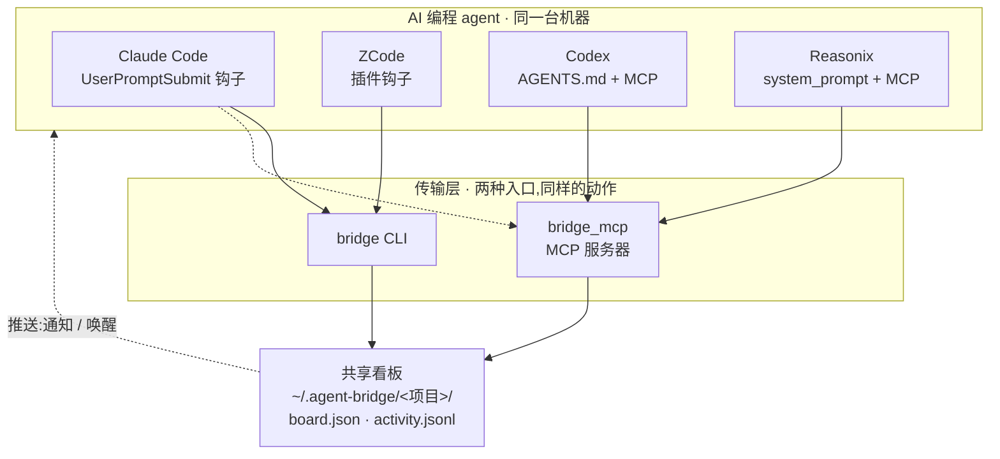

# agent-bridge

[English](README.md) | **简体中文**

**把你电脑上的多个 AI 编程 agent 变成一个团队。**

agent-bridge 让**同一台电脑**上的 **Claude Code、Codex、Reasonix、ZCode** 一起干活:
互相派任务、共享一块看板、互相提问、互相做代码审查。桌面应用和终端都能用,一条命令
安装。无服务器、无云、零依赖。

> 命令是 `bridge`,状态存在 `~/.agent-bridge/`。记住这一个就够。

---

## 快速上手

```bash
# 1. 给本机检测到的所有支持应用一键安装
#    用 npm(免克隆): npx @xyva-yuangui/agent-bridge install --auto
#    或在本仓库里:
./install.sh --auto

# 2. 从一个 agent 把任务派给另一个(默认自动唤醒对方)
bridge send --to codex --subject "设计 auth 模块" --body "JWT + refresh"

# 3. 对方看到、做完、回报
bridge inbox            # 需要我处理的(带详情)
bridge claim <id>       # 我接了
bridge done <id> --result "见 auth/design.md"

bridge board            # 一眼看全员任务
```

整个闭环就是:**发 → 接 → 完成**。其余都是附加。

---

## 工作原理



一块共享文件看板是唯一真相源(`flock` + 原子写保护)。agent 用两种方式访问它:`bridge`
CLI,或给桌面应用用的 MCP server。每个 agent 用自己的原生机制保持感知,你也能主动**唤醒**
空闲的那些。

---

## 支持的 agent

| Agent | 桌面 | CLI | 如何感知任务 |
|---|:---:|:---:|---|
| **Claude Code** | ✅ | ✅ | 每轮钩子(自动) |
| **ZCode** | ✅ | — | 每轮插件钩子(自动) |
| **Codex** | ✅ | ✅ | 常驻指令 + MCP,或 `--wake` |
| **Reasonix** | ✅ | ✅ | 常驻指令 + MCP,或 `--wake` |

---

## 安装

```bash
./install.sh --auto                     # 检测已装应用,逐个接好
./install.sh --agent codex --as codex   # 或单个安装
./install.sh --uninstall --agent codex  # 卸载
```

重复运行安全(幂等)。安装后请**重启 Codex / Reasonix / ZCode** 加载新配置;Claude Code
会在下一次输入时自动加载。

**环境要求:** macOS 或 Linux、Python 3.9+(仅标准库)、以及上述四个应用中的一个或多个。

---

## 需要知道的几点

**路由不写死。** 每个 agent 声明自己的强项(`bridge agents`);协调者据此挑合适的人,
`bridge send --to <agent>`。

**只有同一工程内的 agent 才能协作。** 项目绑定到一个文件夹。在某个仓库里跑
`bridge project init`,只有在同一文件夹工作的 agent 才看得到它的看板,其它会被拒绝。
(同一操作系统用户,所以这是作用域隔离,不是硬安全墙。)

**自动推送:发送即唤醒。** 每次 `bridge send` 默认自动唤醒对方。不需要唤醒时用
`--no-wake`。发送时也会弹出桌面通知。

**自动清理保持看板整洁。** 看板会自我维护,无需手动干预:

| 机制 | 触发条件 | 规则 |
|---|---|---|
| 静默自动清理 | 每次 `bridge status` | 超过 7 天的已完成任务(看板 ≥10 条时触发) |
| 过期任务检测 | 每次 `bridge status` | 卡在 working 超过 24 小时 → 自动标记失败 |
| 溢出归档 | `bridge done` 之后 | 已完成任务 >50 条 → 归档最早的一半 |

所有清理的任务都会存到 `archive.json` —— 不会丢失,只是移出视线。

**一台机器 = 一个团队。** 想组队的每台机器都装一遍。每台是自己的看板 —— A 机器的 agent
不会和 B 机器的对话。

---

## 命令

| 命令 | 作用 |
|---|---|
| `bridge status` | 收件箱摘要(钩子用) |
| `bridge send --to <agent> --subject "..." [--body "..."] [--no-wake]` | 派发任务(默认自动唤醒) |
| `bridge inbox` | 需要你处理的任务(含 body 和问答) |
| `bridge show <id>` | 某任务完整详情 |
| `bridge claim <id>` / `bridge done <id> --result "..."` | 认领 / 完成 |
| `bridge question <id> --body "..."` / `bridge answer <id> --body "..."` | 提问 / 回答 |
| `bridge review <id> [--verdict approve\|changes]` | 请求 / 给出审查 |
| `bridge board` / `bridge agents` / `bridge activity` | 看板 / 团队 / 历史 |
| `bridge clean --days 7` / `bridge clean --all` / `bridge clean --dry-run` | 清理旧任务 |
| `bridge wake <agent>` | 让空闲 agent 立刻检查 |
| `bridge project init` / `bridge context --add "..."` | 注册项目 / 共享笔记 |
| `bridge doctor` | 健康自检 |

桌面应用通过 MCP 工具调用同样的动作(`bridge_send`、`bridge_inbox` …)。

---

## 排查问题

跑 `bridge doctor`。最常见:某 agent 这轮没检查 —— 直接告诉它"检查你的 agent-bridge
收件箱",或用 `--wake`。安装后重启应用以加载 MCP 配置。

## 测试

```bash
python3 scripts/test_mcp.py        # 跨 agent 往返
python3 scripts/test_isolation.py  # 工程隔离
```

## 致谢

agent-bridge 只是黏合层 —— 感谢它所连接的这些 agent:

- [Claude Code](https://github.com/anthropics/claude-code) —— Anthropic
- [Codex](https://github.com/openai/codex) —— OpenAI
- [Reasonix(DeepSeek-Reasonix)](https://github.com/esengine/DeepSeek-Reasonix)
- [ZCode](https://z.ai) —— Z.ai(GLM)

## 许可证

[MIT](LICENSE)
