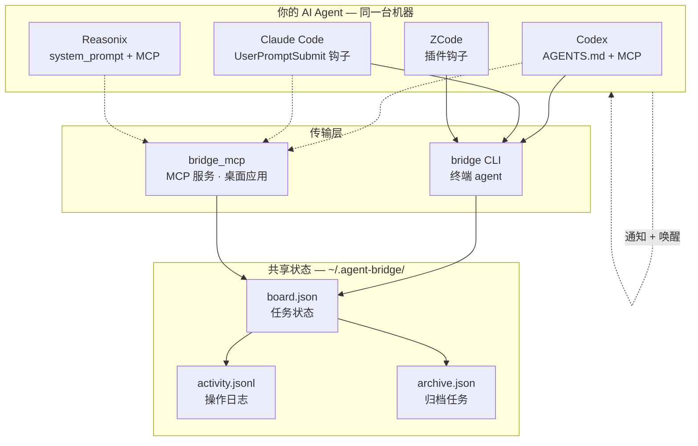
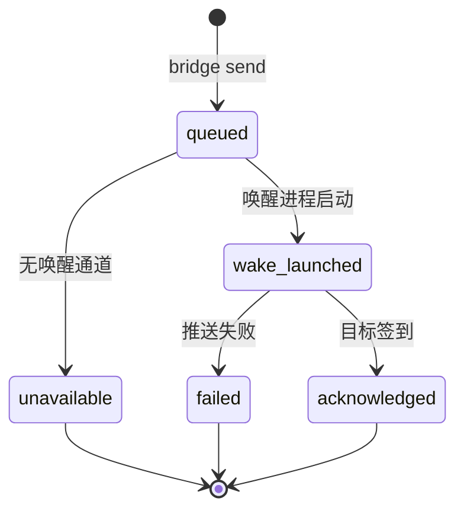
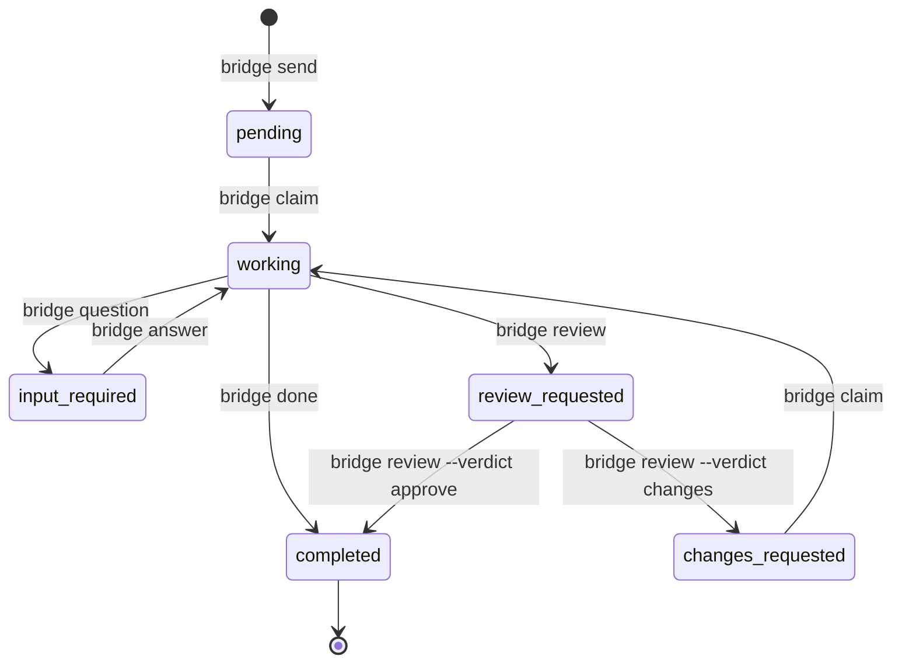

# agent-bridge

[English](README.md) | **简体中文**

<p align="center">
  
  
  
  
  
</p>

**让你电脑上的 AI 编程 agent 组成一个团队。本地运行、零配置、不上云。**

你电脑上装着 Codex、Claude Code、Reasonix、ZCode —— 但它们互相不说话。**agent-bridge** 在你的机器上给它们一块共享任务看板。派活、提问、代码审查 —— 不用离开终端。一条命令安装、零依赖、数据不离开你的电脑。

> 命令是 `bridge`，数据在 `~/.agent-bridge/`。就这些。

---

## 为什么用 agent-bridge？

| | 不用 agent-bridge | 用了 agent-bridge |
|---|---|---|
| **任务交接** | 终端之间复制粘贴 | `bridge send --to codex "设计 auth"` |
| **进度跟踪** | "那个做完了吗？" | `bridge board` — 一眼看全貌 |
| **代码审查** | Slack、PR、来回切换 | `bridge review <id> --verdict approve` |
| **上下文共享** | 散落在各个聊天里 | `bridge context --add "决定用 JWT"` |
| **日常维护** | 手动清理 | 自动清理过期任务、归档旧任务 |

---

## 快速上手

```bash
# 1. 安装 — 一键检测并接入本机所有 agent
# Windows:
.\install.ps1 -Auto

# macOS / Linux:
./install.sh --auto

# 2. 派个任务（默认自动唤醒对方）
bridge send --to codex --subject "设计 auth 模块" --body "JWT + refresh"

# 3. 对方收到、开干、回报
bridge inbox            # 需要我处理的（含详情）
bridge claim <id>       # 我来
bridge done <id> --result "见 auth/design.md"

bridge board            # 所有人任务一览
```

整个闭环：**发 → 接 → 完成**。其余都是锦上添花。

---

## 环境要求

- **Windows 10/11** + PowerShell 5.1+，或 **macOS / Linux** + Bash
- **Python 3.9+**（仅标准库，零 pip 安装）
- 至少一个上述 agent 应用

## 支持的 agent

| Agent | 桌面 | CLI | 如何感知任务 |
|---|:---:|:---:|---|
| **Codex** | ✅ | ✅ | AGENTS.md 指令 + MCP |
| **Claude Code** | ✅ | ✅ | UserPromptSubmit 钩子（自动） |
| **ZCode** | ✅ | — | 插件钩子（自动） |
| **Reasonix** | ✅ | ✅ | system_prompt + MCP，或 `--wake` |

---

## 工作原理



### 交付状态机



### 任务生命周期




## 核心特性

### 跨平台文件锁
Unix 用 `fcntl.flock`，Windows 用 `O_CREAT|O_EXCL` 便携锁。过期锁检测 + PID 校验防止死锁。40 进程并发写入已测试验证。

### 智能路由
每个 agent 声明自己的强项（`bridge agents`），协调者根据团队画像决定派给谁 —— 不用僵硬的路由表。`--skill` 作为路由提示。

### 自动推送：发送即唤醒
每次 `bridge send` 自动唤醒目标 agent。桌面通知 + 无头执行 —— 不用手动切终端。不需要时 `--no-wake`。

### 交付追踪
每次通知尝试可在 `task.delivery.status` 中查看：

| 状态 | 含义 |
|---|---|
| `queued` | 已存储，等待推送 |
| `wake_launched` | 唤醒进程已启动（不代表对方已收到） |
| `acknowledged` | 对方已通过 `status`/`inbox`/`claim` 确认 |
| `unavailable` | 无可用的通知或唤醒通道 |
| `failed` | 推送尝试本身失败 |

### 自动清理
看板自我维护：超过 7 天的已完成任务静默清理，卡在 working 超过 24 小时自动标记失败，溢出任务自动归档到 `archive.json`。

### 100% 本地，100% 隐私
不上云、无服务器、无账号。所有数据都在 `~/.agent-bridge/`。一台机器 = 一个团队。多机同步用 Syncthing、Dropbox 或 git。

---

## 安装

**Windows (PowerShell):**
```powershell
.\install.ps1 -Auto
.\install.ps1 -Agent codex -As codex
.\install.ps1 -Auto -Uninstall
```

**macOS / Linux:**
```bash
./install.sh --auto
./install.sh --agent codex --as codex
./install.sh --auto --uninstall
```

两个安装器均可重复运行（幂等）。安装后重启 agent 应用以加载 MCP 和 hook 配置。

---

## 命令

```text
bridge status [--oneliner]         bridge inbox
bridge send --to NAME --subject TEXT [--body TEXT] [--no-wake] [--skill TAG]
bridge claim ID                    bridge done ID --result TEXT
bridge show ID                     bridge board
bridge question ID --body TEXT     bridge answer ID --body TEXT
bridge review ID [--verdict approve|changes] [--body TEXT]
bridge agents                      bridge activity [--since TS]
bridge project init|list|show      bridge context --show|--add TEXT
bridge clean --days N|--all [--dry-run]  bridge doctor [--strict]
bridge whoami                      bridge wake AGENT
bridge who-coordinates             bridge log --what TEXT
```

MCP 服务暴露同样的 20 个工作流（`bridge_send`、`bridge_inbox` …）。

### 任务生命周期

```
send → pending → claim → working → done → completed
                          ↘ question → input_required → answer → pending
                          ↘ review → review_requested → approve → completed
                                                   ↘ changes → changes_requested → claim → working
```

只有执行者可以 claim、提问、请求审查、完成。只有发送者可以回答问题、给出审查意见。

---

## 排查问题

```bash
bridge doctor --strict       # 完整健康检查
bridge status --oneliner     # 快速收件箱计数
bridge agents                # 查看可用 agent
```

如果任务一直停留在 `wake_launched`，说明 agent 启动了但未签到。重启目标应用并验证 hook/MCP 配置。

---

## 测试

```bash
python -m unittest discover -s tests -v    # 29 个测试
python -m compileall -q scripts tests      # 语法检查
```

Windows 覆盖范围包括：隔离安装/重装/卸载、免依赖通知、GBK 输出、MCP 调用、40 进程并发写入。

## 参与贡献

见 [CONTRIBUTING.md](CONTRIBUTING.md)。

## 许可证

[MIT](LICENSE)
