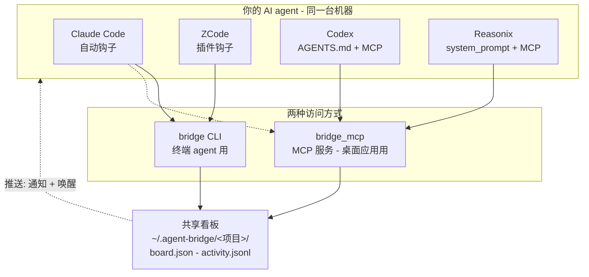

# agent-bridge

[English](README.md) | **简体中文**

**让你电脑上的 AI 编程 agent 组成一个团队。本地运行、零配置、不上云。**

你电脑上装着 Claude Code、Codex、Reasonix、ZCode —— 但它们互相不说话。**agent-bridge** 在你的机器上给它们一块共享任务看板。派活、提问、代码审查 —— 不用离开终端。一条命令安装、零依赖、数据不离开你的电脑。

> 命令是 `bridge`，数据在 `~/.agent-bridge/`。就这些。

---

## 为什么用 agent-bridge？

| | 没有 agent-bridge | 有 agent-bridge |
|---|---|---|
| **任务交接** | 终端之间复制粘贴 | `bridge send --to codex "设计 auth"` |
| **进度跟踪** | "那个做完了吗？" | `bridge board` — 一眼看全貌 |
| **代码审查** | Slack、PR 评论、来回切换 | `bridge review <id> --verdict approve` |
| **上下文共享** | 散落在各个聊天里 | `bridge context --add "决定用 JWT"` |
| **日常维护** | 手动清理 | 自动清理过期任务、归档旧任务 |

**就像给 agent 协作做了个 `git`** —— 每个 agent 都能读写的共享工作区，无服务器、无注册、免费。

---

## 快速上手

```bash
# 1. 一键检测并接入本机所有 agent
./install.sh --auto

# 2. 派个任务（默认自动唤醒对方）
bridge send --to codex --subject "设计 auth 模块" --body "JWT + refresh tokens"

# 3. 对方收到、开干、回报
bridge inbox            # 需要我处理的（含详情）
bridge claim <id>       # 我来
bridge done <id> --result "见 auth/design.md"

bridge board            # 所有人任务一览
```

整个闭环：**发 -> 接 -> 完成**。其余都是锦上添花。

---

## 工作原理



一个 JSON 文件是唯一真相源（`flock` + 原子写保护）。agent 通过 CLI 或 MCP 读写它。每个 agent 在每轮对话开始时检查收件箱 —— 无需轮询、无服务器、不上云。

---

## 支持的 agent

| Agent | 桌面 | CLI | 如何感知任务 |
|---|:---:|:---:|---|
| **Claude Code** | ✅ | ✅ | UserPromptSubmit 钩子（自动） |
| **ZCode** | ✅ | — | 插件钩子（自动） |
| **Codex** | ✅ | ✅ | AGENTS.md 指令 + MCP |
| **Reasonix** | ✅ | ✅ | system_prompt + MCP，或 `--wake` |

---

## 核心特性

### 智能路由（不写死规则）
每个 agent 声明自己的强项（`bridge agents`），协调 agent 根据团队画像决定派给谁 —— 不用僵硬的路由表。`--skill` 作为备选提示。

### 项目级隔离
在仓库里跑 `bridge project init`，只有同一文件夹下工作的 agent 才能看到该项目的看板。不同项目完全隔离。

### 自动推送：发送即唤醒
每次 `bridge send` 自动唤醒目标 agent。桌面通知 + 无头执行 —— 不用手动切终端。不需要时用 `--no-wake`。

### 自动清理（零维护）
看板自我维护，无需手动干预：

| 机制 | 触发条件 | 规则 |
|---|---|---|
| 静默自动清理 | 每次 `bridge status` | 超过 7 天的已完成任务（看板 >=10 条时触发） |
| 过期任务检测 | 每次 `bridge status` | 卡在 working 超过 24 小时 -> 自动标记失败 |
| 溢出归档 | `bridge done` 之后 | 已完成 >50 条 -> 最早一半归档到 `archive.json` |

### 100% 本地，100% 隐私
不上云、无服务器、无账号。所有数据都在 `~/.agent-bridge/`。一台机器 = 一个团队。想多机同步用 Syncthing、Dropbox 或 git。

---

## 安装

```bash
./install.sh --auto                     # 检测所有 agent，逐个接入
./install.sh --agent codex --as codex   # 或单个安装
./install.sh --uninstall --agent codex  # 卸载
```

重复运行安全（幂等）。安装后重启 agent 应用。

**环境要求：** Python 3.9+（仅标准库），以及至少一个上述 agent。

---

## 命令

| 命令 | 作用 |
|---|---|
| `bridge status` | 快速收件箱计数（每轮钩子自动调用） |
| `bridge send --to <agent> --subject "..." [--body "..."] [--no-wake]` | 派发任务（默认自动唤醒） |
| `bridge send --skill coding --subject "..."` | 按技能自动路由到最合适的 agent |
| `bridge inbox` | 需要你处理的任务（含 body 和问答） |
| `bridge show <id>` | 某任务完整详情 —— 动手前先看 |
| `bridge claim <id>` / `bridge done <id> --result "..."` | 认领 / 完成 |
| `bridge question <id> --body "..."` / `bridge answer <id> --body "..."` | 提问 / 回答（阻塞/解阻塞任务） |
| `bridge review <id> [--verdict approve\|changes]` | 请求或给出代码审查 |
| `bridge board` / `bridge agents` / `bridge activity` | 看板 / 团队矩阵 / 活动日志 |
| `bridge clean --days 7` / `--all` / `--dry-run` | 清理旧任务 |
| `bridge wake <agent>` | 主动推送空闲 agent 检查收件箱 |
| `bridge whoami` / `bridge who-coordinates` | 查看身份 / 查看谁在协调 |
| `bridge project init` / `bridge context --add "..."` | 创建项目 / 共享上下文笔记 |
| `bridge doctor` | 健康检查 |

桌面应用通过 MCP 工具调用同样动作：`bridge_send`、`bridge_inbox`、`bridge_claim`、`bridge_done`、`bridge_review`、`bridge_clean` 等。

---

## 排查问题

```bash
bridge doctor    # 检查身份、权限、看板、钩子、agent 心跳
```

最常见：某个 agent 这轮没检查收件箱。直接告诉它"查 agent-bridge inbox"，或 `bridge wake <agent>`。安装后重启应用以加载 MCP 配置。

## 测试

```bash
python3 scripts/test_mcp.py        # 跨 agent 往返测试
python3 scripts/test_isolation.py  # 项目隔离测试
```

## 致谢

agent-bridge 是黏合层 —— 感谢它所连接的 agent：

- [Claude Code](https://github.com/anthropics/claude-code) —— Anthropic
- [Codex](https://github.com/openai/codex) —— OpenAI
- [Reasonix (DeepSeek-Reasonix)](https://github.com/esengine/DeepSeek-Reasonix)
- [ZCode](https://z.ai) —— Z.ai (GLM)

## 许可证

[MIT](LICENSE)
